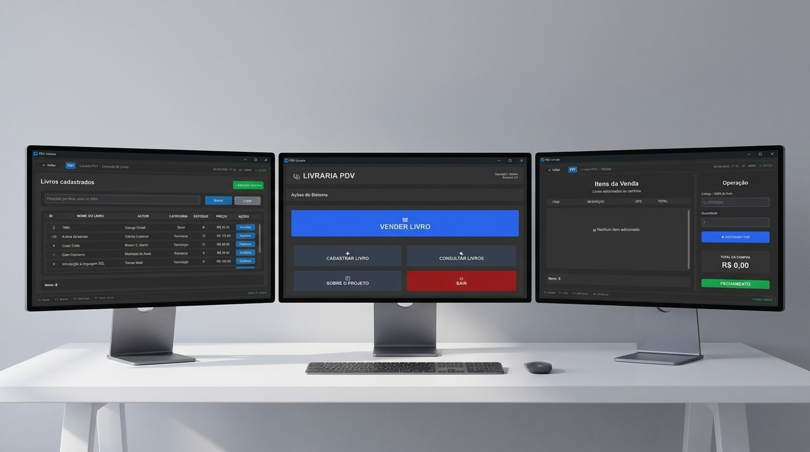
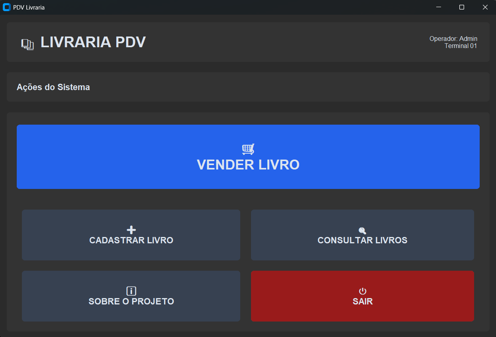
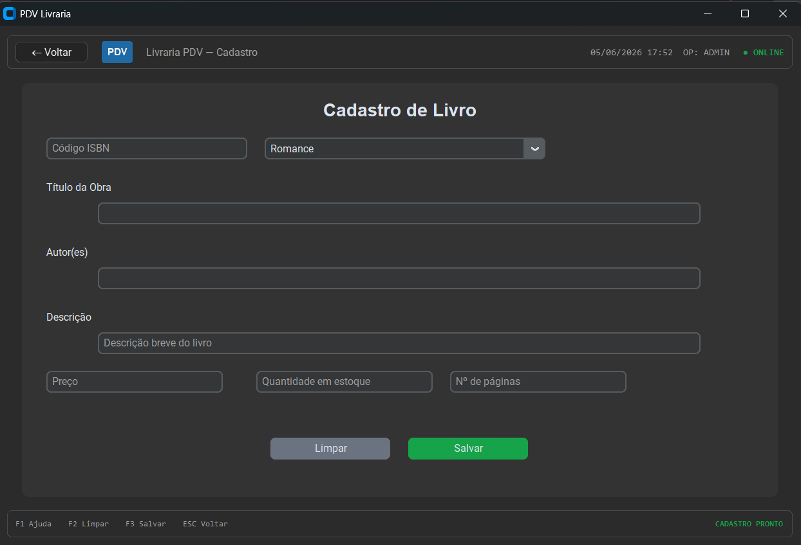
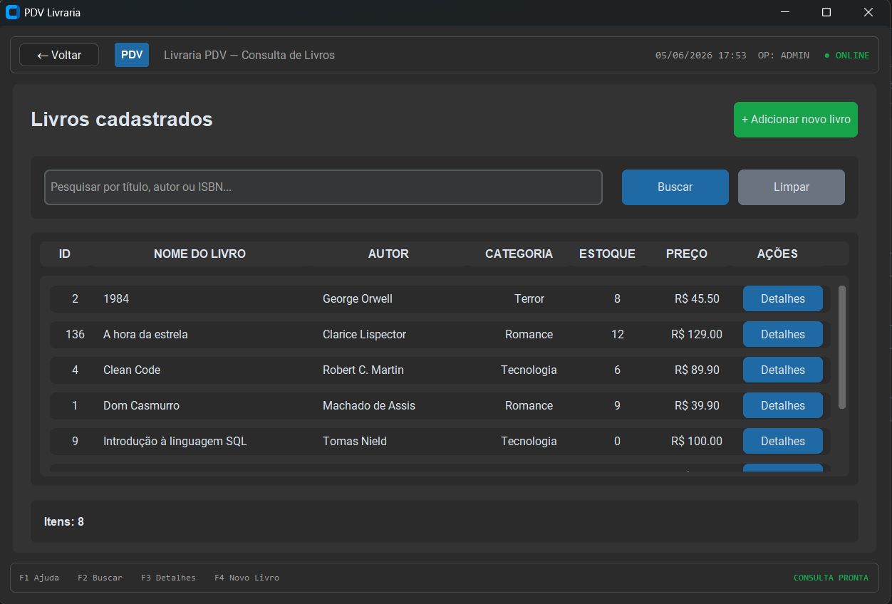
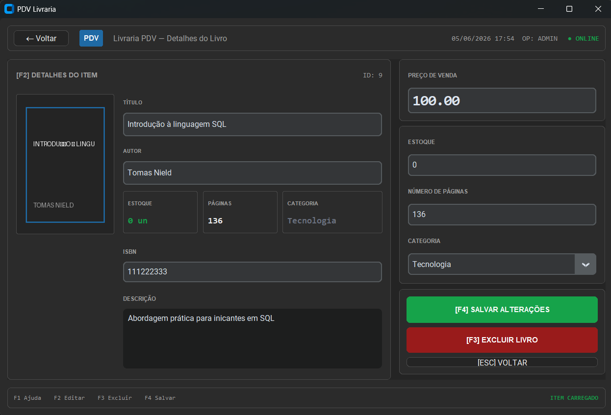
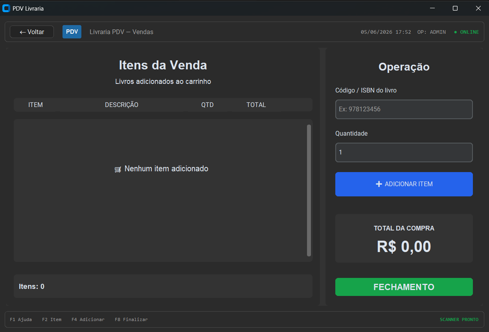

# 📚 Livraria PDV



Projeto acadêmico desenvolvido para a disciplina de **Desenvolvimento Rápido de Aplicações em Python (RAD)**.

O objetivo do projeto é criar um sistema desktop no estilo **PDV (Ponto de Venda)** para uma livraria, utilizando Python, interface gráfica, banco de dados e organização modular do código.

---

## 📌 Sobre o projeto

O **Livraria PDV** é um sistema simples de gerenciamento e venda de livros.

A aplicação permite:

- cadastrar livros;
- consultar livros cadastrados;
- visualizar detalhes de um livro;
- editar informações dos livros;
- excluir livros;
- realizar vendas;
- adicionar itens ao carrinho;
- remover itens do carrinho;
- finalizar pedidos;
- controlar estoque;
- navegar entre telas de forma organizada.

O sistema foi desenvolvido com foco nos conceitos de RAD, priorizando prototipação rápida, entregas incrementais, divisão de tarefas e evolução contínua da interface e das funcionalidades.

---

## 🧰 Ferramentas e tecnologias utilizadas

- Python
- CustomTkinter
- SQLite
- Pillow
- Git e GitHub
- Figma
- VS Code
- Excalidraw

---

## 🗂️ Organização do projeto

A estrutura do projeto foi organizada em pastas para separar responsabilidades e facilitar o desenvolvimento em grupo.

```text
pvd-livraria/
│
├── main.py
│
├── components/
│   ├── buttons.py
│   ├── navbar.py
│   └── footer.py
│
├── db/
│   ├── database.py
│   ├── livros_repository.py
│   ├── vendas_repository.py
│   └── livraria_pdv.db
│
├── screens/
│   ├── tela_inicial.py
│   ├── cadastro_livros.py
│   ├── consulta_livros.py
│   ├── pdv_detalhes.py
│   └── vendas.py
│
├── assets/
│   ├── icons/
│   └── images/
│
├── requirements.txt
└── README.md
```

---

## 📁 Explicação das principais pastas
- ```main.py:```
Arquivo principal da aplicação.
É responsável por iniciar o sistema, criar o banco de dados e abrir a tela inicial.

- ```components/:``` Pasta com componentes reutilizáveis da interface.
Contém elementos usados em várias telas: navbar e footer. Isso ajuda a manter o visual padronizado em todo o sistema.

- ```db/:``` Pasta responsável pelo banco de dados e pelas operações com SQLite. Contém:
    - criação das tabelas;
    - conexão com o banco;
    - funções de cadastro, consulta, edição e exclusão de livros;
    - registro de vendas;
    - baixa de estoque.

- ```screens/:``` Pasta com as telas principais do sistema.

<br>

**Cada tela foi separada em um arquivo próprio para facilitar a organização e o trabalho em equipe.**

---

## 🖥️ Telas do sistema
### Tela inicial



Tela principal do sistema, funcionando como menu de acesso às outras áreas. Responsável por direcionar o usuário para:
- vendas;
- cadastro;
- consulta;
- demais funcionalidades.

### Tela de cadastro



Permite cadastrar novos livros no banco de dados. Campos principais:
- ISBN;
- título;
- autor;
- descrição;
- categoria;
- preço;
- estoque;
- número de páginas.
- Tela de consulta

### Tela de consulta




Permite visualizar os livros cadastrados e pesquisar por:
- título;
- autor;
- ISBN.

### Tela de detalhes




Exibe informações completas de um livro específico. Permite:

- visualizar dados do livro;
- editar informações;
- salvar alterações;
- excluir livro.


### Tela de vendas



Permite:
- buscar livro pelo ISBN;
- adicionar livro ao carrinho;
- remover item do carrinho;
- cancelar pedido;
- finalizar venda;
- registrar venda no banco;
- atualizar o estoque automaticamente.

---

## 🧑‍💻 Participantes e divisão de tarefas
| Participante | Responsabilidade |
| --- | --- |
| [Junior](https://github.com/juniornailsonn) | [Tela Inicial](#tela-inicial)l |
| [Gabriel](https://github.com/gbielsn06-art) | [Tela de cadastro](#tela-de-cadastro) |
| [João](https://github.com/joaogodhenrique-design) | [Tela de consulta](#tela-de-consulta) |
| [Vinicios](https://github.com/vinigabrielmag-bot) | [Tela de detalhes](#tela-de-detalhes) |
| [Brenno](https://github.com/brennodeveloper) | [Tela de vendas](#tela-de-vendas) |


Durante o desenvolvimento do projeto, foram trabalhados conceitos importantes, como:

- desenvolvimento rápido de aplicações;
- prototipação de interfaces;
- organização de projeto em pastas;
- criação de interface gráfica com CustomTkinter;
- manipulação de banco de dados SQLite;
- criação de CRUD;
- versionamento com Git e GitHub;
- integração entre telas;
- reaproveitamento de componentes;
- trabalho em equipe;
- tratamento de erros;
- fluxo de navegação entre telas;
- controle de estoque em vendas.

---

## 🗄️ Banco de dados
O banco de dados utilizado foi o SQLite.

Principais tabelas:

- categorias
- livros
- vendas
- itens_venda

O banco armazena os livros cadastrados, suas categorias, as vendas realizadas e os itens de cada venda.

---

## ▶️ Como executar o projeto
1. Clonar o repositório
git clone URL_DO_REPOSITORIO
2. Entrar na pasta do projeto
cd pvd-livraria
3. Instalar as dependências
```pip install -r requirements.txt```
4. Executar o sistema ```python main.py```

___

## ⚠️ Observações

O sistema deve ser executado pelo arquivo main.py.

Não é recomendado executar as telas individualmente, pois isso pode causar erros de importação entre as pastas do projeto.